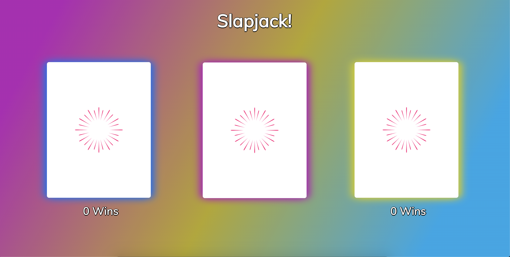

# Slapjack
Mod 1 Solo Final Project
### Developer
- [Leigh Larson](https://github.com/leighlars)
### Project Manager
- [Leta Keane](https://github.com/letakeane)
### Project Links
- [Repo](https://github.com/leighlars/slapjack)
- [Deployed Page](https://leighlars.github.io/slapjack/)
- [Project Spec](https://frontend.turing.io/projects/module-1/slapjack.html)

## Set-up
- Fork the repo and clone down into terminal
- Open in text editor
- Read the README
- In terminal, run command "open index.html" to interact with app.
- You can also interact with the app by opening the app via the Deployed Pages link above.

## Overview & Learning Goals
For the mod 1 solo final project, I will build an application that enables two users to use one keyboard to play the card game of Slapjack. See Gameplay section below for instructions on gameplay.

I will demonstrate my skills and understanding of semantic HTML, clean and organized CSS styles, DRY and organized JS, DOM and data model manipulation, event bubbling/delegation, and persisting data over refreshes using local storage.

My estimated schedule is as follows:
- **6/4-5/2020** Set up repo, Slack channel, DTR, project board, ReadMe. Wireframe HTML/CSS, review project rubric and spec and pseudocode basic outline of what elements are needed and what functionality to be implemented.Set up JS class files with properties and methods. Initiate crude construct of semantic HTML & organized CSS.
- **6/6/2020** Begin JS implementation.
- **6/7/2020** Continue JS.
- **6/8/2020** If there is time, add local storage functionality to project. If not, spend the time refactoring and making sure all teammates comprehend the code.
- **6/9/2020** Polishing, refactoring of code and ReadMe. Add screenshots/gifs to ReadMe and files.

## Gameplay

- Players alternate turns playing cards face-up into the central pile (ex a player can’t deal twice in a row)
- Any player can slap at any time, with several outcomes!
- The entire central pile is added to the player’s hand, and their hand is shuffled automatically when:

A) If a player slaps when a Jack is on top of the central pile, B) If a player slaps when a Double or a pair (two cards of the same number - such as two Aces, or two Fives, or two Queens) C) If a player slaps when a Sandwich (two cards of the same number - such as two Aces, or two Fives, or two Queens, separated by a different card in the middle) is on top of the central pile.

- Otherwise, the player who slapped loses the card on top of their hand and it is added to the bottom of their opponent’s hand.
- If one player loses all their cards, they have one chance to not lose and continue the game:
- The player with cards left continues to deal from their hand into the central pile (they are now allowed to deal multiple times in a row!)
- If the player with cards left deals all their cards into the center without revealing a Jack, the central pile returns to that player’s hand, is shuffled, and the player must continue to deal until a Jack is revealed
- When a Jack is revealed, the player who is out of cards can slap it. The central pile is then their new hand, the game continues as normal.
- If however, the player who is out of cards slaps something that is not a Jack, or if the player who still has cards slaps the Jack first, then the player who is out of cards loses and the game is over!
- Doubles and Sandwiches are not valid when one player is completely out of cards - in this case, only a Jack can save them!
- The only way the player who still has cards can win is by slapping the Jack before the player without cards left does

## Progression

Image of Desktop View  
  

6/4: This was initial setup day. Set up repo, Slack channel, DTR, project board, ReadMe. Wireframe HTML/CSS, review project rubric and spec and pseudocode basic outline of what elements are needed and what functionality to be implemented.Set up JS class files with properties and methods. Initiate crude construct of semantic HTML & organized CSS. I added the properties and most of the methods for Player and Game classes for console play with the data model. I also added localStorage functions to Player but they are not invoked. It's possible some of my data model functionality may have a bug when events occur, but I'll fix that problem after I add event functionality / listeners. 

6/5:

6/6:

6/7:

## Functionality Showcase

Image of Desktop View  
  

Image of Mobile View  
  

